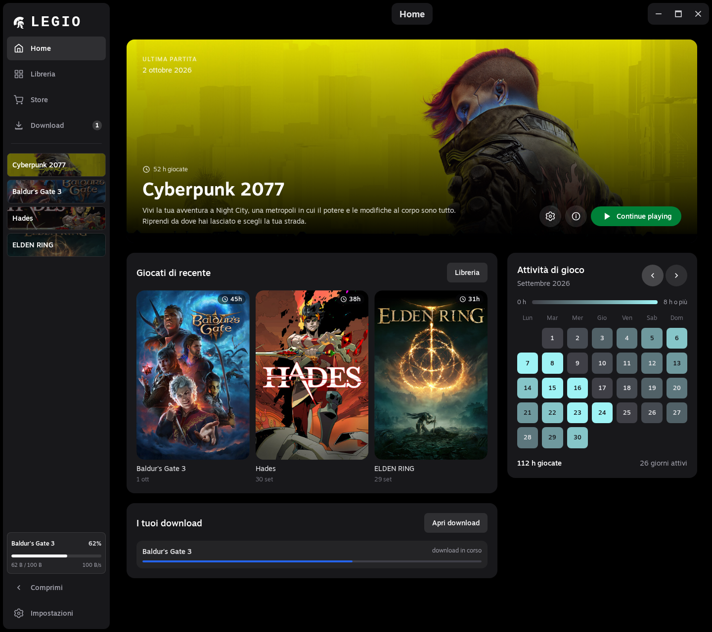

  
  <h1>Legio</h1>
  
La tua libreria di giochi, con avvii e impostazioni pronti per ogni titolo.

  
<a href="https://github.com/fraa2a/Legio/releases">Scarica Legio</a>

  

Legio è un launcher desktop per Windows e Linux. Importa i giochi da Steam o aggiungili manualmente, configura come avviarli e tieni sotto controllo download e tempo di gioco.

## Funzionalità

- **Un account Steam per ogni gioco.** Se usi più account, assegna quello giusto a ciascun titolo. Quando serve cambiare account, Legio ti chiede conferma prima di riavviare Steam.
- **Impostazioni di avvio per gioco.** Su Linux avvia giochi nativi o giochi Windows con Proton, GE-Proton o Wine e configura prefix, argomenti, variabili d'ambiente e override DLL. Su Windows imposta argomenti, cartella di lavoro e variabili d'ambiente.
- **Importazione flessibile.** Rileva la libreria Steam oppure aggiungi giochi e relativi eseguibili manualmente.
- **Download sotto controllo.** Metti in pausa e riprendi i download, riordina la coda, riprova quelli non riusciti e imposta un limite di banda. I download verificati possono essere controllati con SHA-256.
- **Attività di gioco a colpo d'occhio.** Consulta gli ultimi giochi avviati, il tempo di gioco e il calendario delle tue sessioni.
- **Una Home più personale.** Scegli un tema, modifica colori e sfondo e trova copertine e dettagli dei giochi nella libreria.
- **Collegamenti sul desktop.** Avvia i tuoi giochi anche dal desktop del sistema.

## Online Fix

Legio include un'opzione Online Fix per i giochi compatibili. È uno strumento di configurazione dell'avvio: Legio non fornisce né distribuisce file di gioco o file Online Fix.

Legio non supporta né promuove la pirateria. Usa questa opzione solo con una copia del gioco regolarmente acquistata e per giocare offline, nel rispetto della licenza del gioco e delle leggi applicabili. L'utente è responsabile del proprio utilizzo; Legio non si assume responsabilità per usi impropri.

## Download

Scarica l'ultima versione dalla pagina [Releases](https://github.com/fraa2a/Legio/releases). Sono disponibili pacchetti per Windows e Linux. Per avviare giochi Windows su Linux, installa prima un runner compatibile come Proton o Wine.

Per Steam e i giochi che lo richiedono è necessario avere Steam installato sul dispositivo.

## Licenza

Consulta [LICENSE](LICENSE) per i termini di utilizzo e distribuzione.
