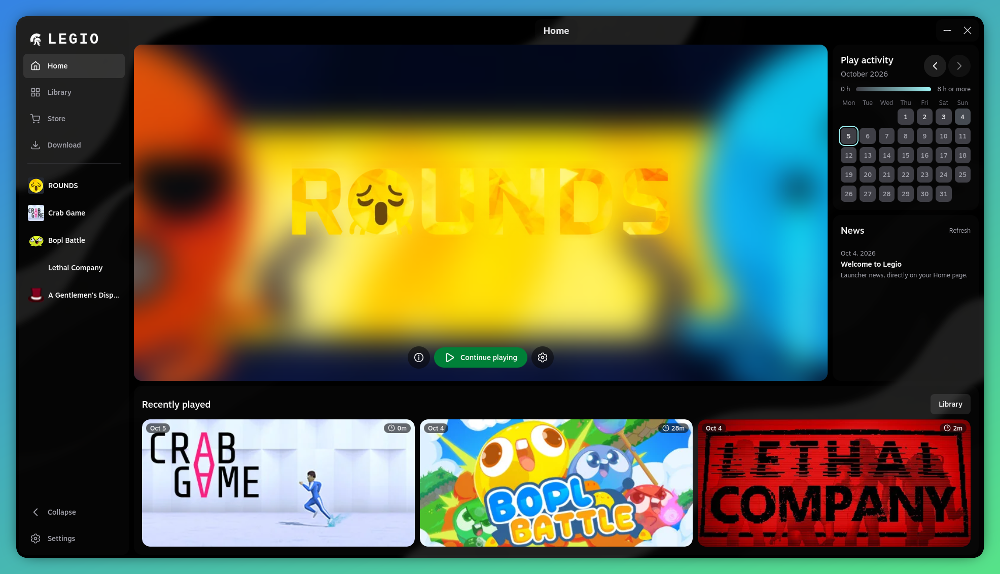

  
  <h1>Legio</h1>
  
Your game library, with launch settings tailored to each title.

  
<a href="https://github.com/fraa2a/Legio/releases">Download Legio</a>

Legio is a desktop game launcher for Windows and Linux. Import games from Steam or add them manually, configure how each game launches, and keep your library and playtime in one place.

## Features

- **A Steam account for each game.** If you use multiple accounts, assign the right one to each title. Legio asks before restarting Steam to switch accounts when needed.
- **Per-game launch settings.** Run native Linux games or Windows games through Proton, GE-Proton, or Wine. Configure prefixes, launch arguments, environment variables, and DLL overrides on Linux, or native launch options on Windows.
- **Flexible game import.** Detect your Steam library or add games and executables manually.
- **Themes you can make your own.** Choose from built-in palettes, edit colors, set image or animated backgrounds, and save your own themes. Import and export themes as JSON.
- **Hyprland transparency.** Enable a transparent Legio window on Hyprland and adjust the surface opacity. Background blur is controlled by your Hyprland rules.
- **Playtime at a glance.** See recently played games, tracked playtime, and a calendar of your activity.

## Online Fix

Legio includes an Online Fix launch option for compatible games. It is a launch configuration feature: Legio does not provide or distribute game files or Online Fix files.

Legio does not support or promote piracy. Use this option only with a legitimately purchased copy of the game and for offline play, in accordance with the game's license and applicable laws. Users are responsible for their use of this feature; Legio accepts no responsibility for misuse.

## Download

Get the latest version from [Releases](https://github.com/fraa2a/Legio/releases). Packages are available for Windows and Linux. To run Windows games on Linux, install a compatible runner such as Proton or Wine first.

Steam must be installed for Steam integration and for games that require it.

Manual Proton and GE-Proton games use [umu-launcher](https://github.com/Open-Wine-Components/umu-launcher).
umu is a runtime dependency for these games, not for native Linux games, Wine
launches or games launched through Steam.

- **Standalone Linux downloads (AppImage, .deb and .rpm):** umu is not bundled.
  Install `umu-launcher` separately and make `umu-run` available on your PATH or
  in `~/.local/bin`.
- **Arch Linux / AUR (`legio-launcher-bin`):** `umu-launcher` is declared as a
  package dependency, so an AUR helper such as yay or paru installs it alongside
  Legio. Enable the `multilib` repository, which provides `umu-launcher`.

umu manages and downloads the required Steam Linux Runtime. A compatible Proton
or GE-Proton runner must still be installed separately.
Steam-managed games continue to launch through Steam. Manual games only need Steam
when Steam integration or Online Fix is enabled. Existing Wine and Proton prefixes
are reused without moving save files. A shared prefix can run one game at a time.

The runner's graphics and Wayland defaults clear inherited overrides for those two
options. Explicit environment overrides for shader caching are preserved. vkd3d
shader caches use a separate per-game cache directory. Game-specific umu fixes can
be selected with the documented `GAMEID` and `STORE` environment variables; Legio
does not infer an umu ID from a Steam App ID.

## Download sources

Add an HTTPS catalog in **Settings > Sources**. You can install multiple sources,
refresh their cached releases, and remove them individually. No download source
is configured by default.

After starting Legio once, opening a link such as
`legio://add-source?url=https%3A%2F%2Fcatalogo.example%2Fgames.json`
opens the launcher and adds the catalog. The browser may ask to open Legio.
AppImage users need `xdg-utils` and `desktop-file-utils` for protocol registration;
keep the AppImage at a stable path, or run it again after moving it.

## Development

Run `corepack pnpm install` and `corepack pnpm tauri dev` for local development.
Tauri development runs use the `dev.fraa2a.legio.dev` application identifier,
with a separate persistent database, settings, cache and logs. The first dev run
starts with an empty library; subsequent dev runs reuse their own data.
Installed builds keep using `dev.fraa2a.legio`. Existing installed data is not
copied, migrated or reset by development runs.

## Documentation

- [Source schemas and download flow](_meta/docs/SCHEMA.md)
- [Releases and updates](_meta/docs/UPDATING.md)

## License

See [LICENSE](LICENSE) for the terms of use and distribution.

### Optional Linux performance controls

The compatibility panel of each manually imported game offers GameMode and gamescope. They are disabled by default and require the corresponding executable in PATH or ~/.local/bin. Install the distribution packages and reopen the panel to refresh availability. GameMode also needs a working user service and its preload libraries; Legio does not change its system configuration.

With gamescope enabled, choose a native or explicit internal resolution and an optional frame cap. Commands use the structured order `gamescope [numeric options] -- gamemoderun umu-run game.exe [game arguments]`; disabled wrappers are omitted and Wine replaces umu-run for Wine runners. Steam-managed games keep their existing client launch path. Resolution and FPS are validated before saving and launching. A lower internal resolution changes visual quality, and the additional compositor can change latency. GameMode, gamescope and native Wine Wayland are independent controls. Compare each change against the default for the same game; no FPS gain is guaranteed.

References: [umu-launcher](https://github.com/Open-Wine-Components/umu-launcher), [vkd3d-proton shader cache](https://github.com/HansKristian-Work/vkd3d-proton), [GameMode](https://github.com/FeralInteractive/gamemode) and [gamescope](https://github.com/ValveSoftware/gamescope).

Transfer recovery runs on a blocking worker during startup. Application hydration and desktop shortcuts wait asynchronously for recovery. Launching, removal, transfers, import, finalization and download mutations cannot race incomplete recovery, and a recovery failure remains visible in the launch error banner. Download recovery retains its existing dedicated worker.

UI refresh timers for playtime, monthly activity and news stop while the window is inactive and refresh on focus restore. Download progress polling and the event-backed launch recovery poll also stop while hidden; downloads and native lifecycle monitoring keep running. The launch polling fallback remains active if native event subscription fails. Steam artwork refresh timers wait until the window is active.
