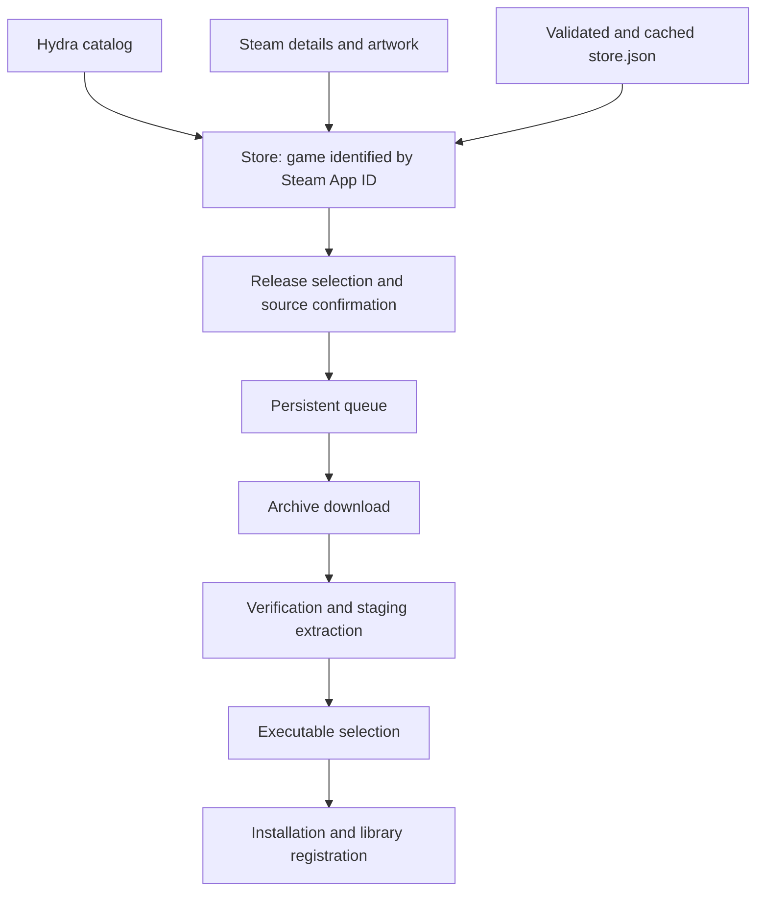

# Source schemas and downloads

This document describes the contracts currently consumed by Legio, their validation rules, and the steps from a catalog release to an installed game. Examples use fictional URLs and illustrative hashes. Publishing a release requires direct URLs, actual file sizes, and hashes computed from the final archive.

## Data sources

| Source | Responsibility | Contract |
| --- | --- | --- |
| Hydra | Catalog search and game names | Search response with `count` and `edges` |
| Steam Store | Game details and Steam artwork | `appdetails` API and Steam assets |
| Legio Store | Available releases, archive URLs, and source classification | User-configured HTTPS manifests |
| Legio News | Bilingual articles on Home | `https://source.taxphobia.top/news.json` |
| GitHub Releases | Launcher updates | `latest.json`, installers, and Tauri signatures |

The Steam App ID connects catalog records, Steam details, and releases. A Hydra result does not provide a download or imply that a release is verified. One game can have multiple releases with different trust classifications.



## Store manifest: `store.json`

### Complete document

```json
{
  "schemaVersion": 1,
  "generatedAt": "2026-10-05T12:00:00Z",
  "verified": [
    {
      "steamAppId": 400,
      "name": "Portal",
      "release": {
        "version": "1.0.0",
        "publishedAt": "2026-10-05T12:00:00Z"
      },
      "download": {
        "url": "https://downloads.example.invalid/portal-1.0.0.zip",
        "sha256": "0123456789abcdef0123456789abcdef0123456789abcdef0123456789abcdef",
        "sizeBytes": 123456789
      }
    }
  ],
  "unverified": [
    {
      "steamAppId": 400,
      "name": "Portal modded",
      "release": {
        "version": "2.0.0-mod",
        "publishedAt": "2026-10-05T13:00:00Z"
      },
      "download": {
        "url": "https://downloads.example.invalid/portal-modded.7z",
        "sizeBytes": 234567890
      }
    }
  ]
}
```

### Fields and validation

All objects use `camelCase` field names and reject unknown fields. The parser accepts documents up to 2 MiB and rejects the entire manifest if any entry is invalid.

| Field | Type | Rule |
| --- | --- | --- |
| `schemaVersion` | `u32` integer | Required; must be `1` |
| `generatedAt` | String | Required RFC 3339 timestamp with a UTC offset; both `Z` and `+00:00` are accepted |
| `verified` | Array of entries | Required; may be empty |
| `unverified` | Array of entries | Required; may be empty |
| `steamAppId` | `u32` integer | Required; greater than zero |
| `name` | String | Required; nonempty after trimming whitespace |
| `release` | Object | Required; contains `version` and `publishedAt` |
| `release.version` | String | Required; nonempty after trimming whitespace; SemVer and version ordering are not enforced |
| `release.publishedAt` | String | Required RFC 3339 timestamp with a UTC offset |
| `download` | Object | Required; contains archive metadata |
| `download.url` | URL string | Required HTTP or HTTPS URL with a host, without credentials or a fragment; query parameters are allowed |
| `download.sha256` | String or `null` | For `verified`, a string of 64 lowercase hexadecimal characters is required; for `unverified`, it may be omitted or `null` |
| `download.sizeBytes` | `u64` integer | Required; greater than zero; exact archive size in bytes |

The manifest does not allow fields for scripts, commands, torrents, passwords, multipart archives, or installation instructions. To queue a download, its size must also fit in a SQLite `i64` integer.

Entries are identified by the tuple `(steamAppId, download.url, release.version)`. Repeating a tuple in any list invalidates the document. The `verified` list also rejects repeated `(steamAppId, download.sha256)` pairs. A Steam App ID may appear multiple times for distinct releases.

### Trust and integrity

`verified` means the release is classified as verified by the configured source publisher; it is not a safety guarantee. The classification applies to the selected release rather than every release of the game.

An `unverified` release requires explicit confirmation before downloading. If such an entry provides `sha256`, it is accepted as a string but is not validated as a hash and is never compared with the downloaded file.

For `verified` releases, SHA-256 verification before extraction is enabled by default. The global `verifyVerifiedDownloads` setting can disable the comparison, but the manifest must still contain a valid hash. Size checks and extraction protections remain active in both cases.

### Transport, cache, and snapshot

Legio ships without configured download sources. Users can add and remove up to 16 HTTPS manifest URLs in Settings > Sources, or add one through `legio://add-source?url=<percent-encoded HTTPS URL>`. Duplicate URLs are idempotent. A source is installed only after its manifest has been downloaded and validated. Source requests do not follow redirects.

Each source has its own SQLite `download_sources` row, stable ID, manifest, fetch time, and refresh warning. Refreshes retain each source's last valid cache on failure. Removing a source immediately removes its releases from the Store without changing installed games or existing download jobs. Late refreshes cannot restore a removed source. Updating from the previous schema clears the legacy source cache.

The combined manifest deduplicates identical releases by Steam App ID, archive URL, and version. Conflicting metadata or classifications for the same tuple are omitted with a warning until the sources are corrected or removed.

The frontend contract returned by `get_legio_source` and `refresh_legio_source` is:

```json
{
  "manifest": null,
  "cachedAt": null,
  "stale": false,
  "warning": null,
  "sources": []
}
```

`manifest` contains the document when available. `cachedAt` is a Unix timestamp in seconds, separate from `generatedAt`. The cache becomes stale after 24 hours, if its fetch time is in the future, or if a refresh fails. On failure, refresh returns the last valid cache with `warning` and `stale: true`. With no configured sources, refresh makes no source requests and returns an empty, non-stale snapshot. `sources` lists each installed source as `{ id, url, cachedAt, stale, warning, gameCount }`.

The Store groups results by Steam App ID and lets users choose a release by name and version. Aggregated catalog availability uses `unknown`, `unavailable`, `verified`, or `unverified`. Without a matching entry, downloading is unavailable.

## Download contract and behavior

### Queue request

The frontend invokes `queue_download` with these arguments:

```json
{
  "steamAppId": 400,
  "downloadUrl": "https://downloads.example.invalid/portal-1.0.0.zip",
  "releaseVersion": "1.0.0",
  "acceptUnverified": false
}
```

Rust looks up the exact tuple in the validated source cache. The frontend cannot supply arbitrary size, hash, name, or trust classification. An unverified release requires `acceptUnverified: true`. Queueing stores a snapshot of the selected metadata and its `source_verified` classification; later manifest refreshes do not change the job.

### Job returned to the frontend

`list_downloads` returns an array of jobs; `queue_download` returns the created job.

| Field | Type | Meaning |
| --- | --- | --- |
| `id` | UUID string | Local job identity, independent of the Steam App ID |
| `steamAppId` | Number | Associated game |
| `name` | String | Selected release name |
| `releaseVersion` | String | Selected version |
| `url` | String | Archive URL copied from the source |
| `sha256` | String or `null` | Declared hash; does not imply that verification runs |
| `sizeBytes` | Number | Expected archive bytes |
| `downloadedBytes` | Number | Transferred bytes |
| `speedBps` | Number | Speed in bytes per second |
| `etaSeconds` | Number or `null` | Estimated remaining time in seconds |
| `status` | String | One of the states in the following table |
| `error` | String or `null` | Error details |
| `updatedAt` | Number | Unix timestamp in seconds of the last update |

JSON fields use `camelCase`; states use `snake_case`. SQLite also stores queue order, ETag, and staging/finalization data, which are not part of `DownloadJob`.

### States and actions

The normal path is `queued -> downloading -> downloaded -> staging -> staged -> finalizing -> installed`.

| State | Meaning and actions |
| --- | --- |
| `queued` | Awaiting transfer; can be reordered, paused, or cancelled |
| `downloading` | Transfer in progress; can be paused or cancelled |
| `waiting` | Waiting after a network problem; can resume when connectivity recovers, be resumed manually, paused, or cancelled |
| `paused` | Suspended by the user; can be resumed or cancelled |
| `failed` | Transfer, verification, or installation error; can be retried, cancelled, or removed from the list |
| `downloaded` | Complete archive; verification/extraction starts automatically |
| `staging` | Verification and extraction in progress |
| `staged` | Extraction complete; awaiting executable selection and finalization |
| `finalizing` | Moving/copying files into the final installation and registering the game in the library |
| `installed` | Installation complete; the job can be removed from the list |
| `cancelled` | Cancelled; download files are cleaned up and the job can be removed |

Removing an installed job from the list does not uninstall the game. The queue persists and recovers interrupted transfers and operations at startup. A downloaded archive alone is not treated as an installed game.

### Transfer and extraction

The worker transfers one archive at a time in queue order. It uses `<id>.part`, then `<id>.archive`, in the `downloads` directory under the current storage path. Extraction uses `<id>.stage`.

The URL must point directly to the file: the download client does not follow redirects. A new transfer requires HTTP `200`; resuming uses `Range` and, when available, a strong ETag with `If-Range`. If the partial response is inconsistent, the transfer restarts from zero. Bytes cannot exceed `sizeBytes`, and the download completes only when the size matches exactly. The bandwidth limit is expressed in bytes per second; `0` means unlimited.

SHA-256 verification, when enabled for a verified release, precedes extraction. A hash mismatch removes the corrupt archive and requires a retry.

Single ZIP, 7z, and RAR archives are supported and identified by their content signatures. The extractor rejects unsupported formats, multipart archives, unsafe paths, links and special files, and duplicate paths even when capitalization differs. There is no password field for encrypted archives. Limits are 100,000 entries and an expanded size no greater than the smaller of 64 GiB and 200 times the archive size. Incomplete staging is cleaned up on error.

### Executable selection and installation

`scan_staged_executables` receives `{ "id": "<uuid>", "gameName": null }` and returns `candidates` and `selectedRelativePath`. Each candidate contains `relativePath`, `score`, and `signals`. Scanning proposes an executable; it does not launch it.

`finalize_download` receives `{ "id": "<uuid>", "executableRelative": "Game/game.exe" }`. The path is relative to staging and is validated to prevent escaping the directory or traversing symbolic links. Finalization installs files in the configured location and registers the game in the library. Persistent intents and markers allow recovery of interrupted finalization.

## Hydra catalog and Steam details

Legio sends a POST request to `https://hydra-api-us-east-1.losbroxas.org/catalogue/search`:

```json
{ "title": "Portal", "take": 50, "skip": 0 }
```

The consumed response has this shape:

```json
{
  "count": 1,
  "edges": [{ "objectId": "400", "title": "Portal", "shop": "steam" }]
}
```

Only `shop: "steam"` entries are considered, with `objectId` convertible to a positive Steam App ID and a nonempty title of at most 512 bytes without control characters. Duplicate IDs within a page and inconsistent counts are rejected. Search queries allow at most 200 UTF-8 bytes without control characters; a remote page contains at most 50 entries and responses are limited to 2 MiB. These Hydra objects do not use the strict `deny_unknown_fields` schema of the Legio manifest.

Details come from `https://store.steampowered.com/api/appdetails`, using the App ID and requested language. Artwork comes from Steam hosts allowed by the client. These data support game presentation and do not define download URLs, releases, or source trust.

## News manifest: `news.json`

The example uses placeholders for Italian content; published articles must supply actual Italian and English translations.

```json
{
  "schemaVersion": 1,
  "generatedAt": "2026-10-05T12:00:00Z",
  "items": [
    {
      "id": "welcome",
      "publishedAt": "2026-10-05T12:00:00Z",
      "title": { "it": "<Italian title>", "en": "Welcome" },
      "summary": { "it": "<Italian summary>", "en": "Legio news" },
      "body": { "it": "<Italian body>", "en": "Full article\nSecond paragraph" }
    }
  ]
}
```

The document is limited to 512 KiB. `schemaVersion`, `generatedAt`, and `items` are required, and unknown fields are rejected at every level.

| Field | Rule |
| --- | --- |
| `schemaVersion` | Integer; must be `1` |
| `generatedAt`, `publishedAt` | RFC 3339 UTC timestamps ending in `Z`; `+00:00` is not accepted here |
| `items` | At most 100 articles |
| `id` | Unique, 1 to 64 bytes, containing only lowercase ASCII letters, digits, and `-` |
| `title` | Object with required `it` and `en` strings, each nonempty and at most 160 characters |
| `summary` | Same bilingual object; at most 600 characters per language |
| `body` | Same bilingual object; at most 12,000 characters per language |

Control characters are forbidden, except line breaks and tabs in the body. Content is plain text rather than HTML. Home hides articles with future publication dates, sorts newest first, and shows the first 20; full text opens in a dialog.

The validated cache persists in SQLite under `settings.news_cache`. The frontend snapshot contains `feed`, `cachedAt`, and `warning`, all nullable. Home reads the cache immediately and refreshes the feed when it is at least 15 minutes old; errors preserve the last usable copy. Text follows the launcher language and dates follow the system locale.

## Update manifest: `latest.json`

This contract covers the Legio application rather than game archives. The pipeline generates it through `scripts/release_manifest.py` and publishes it in the GitHub Release. The configured stable endpoint is `https://github.com/fraa2a/Legio/releases/latest/download/latest.json`.

```json
{
  "version": "1.2.3",
  "platforms": {
    "linux-x86_64-deb": {
      "url": "https://github.com/fraa2a/Legio/releases/download/v1.2.3/Legio.deb",
      "signature": "<contents of the .sig file>"
    },
    "linux-x86_64-rpm": {
      "url": "https://github.com/fraa2a/Legio/releases/download/v1.2.3/Legio.rpm",
      "signature": "<contents of the .sig file>"
    },
    "linux-x86_64-appimage": {
      "url": "https://github.com/fraa2a/Legio/releases/download/v1.2.3/Legio.AppImage",
      "signature": "<contents of the .sig file>"
    },
    "windows-x86_64-nsis": {
      "url": "https://github.com/fraa2a/Legio/releases/download/v1.2.3/Legio.exe",
      "signature": "<contents of the .sig file>"
    }
  }
}
```

The version comes from `src-tauri/Cargo.toml`. The generator requires exactly one bundle for each format and its corresponding `.sig` file. Tauri verifies the signature against the configured public key before installation. Prereleases do not replace the stable channel. For releases, AUR packages, and update management, see [UPDATING.md](UPDATING.md).

## Code references

- [Store manifest parser](../../src-tauri/src/legio_source.rs) and [source cache](../../src-tauri/src/legio_source_cache.rs).
- [Hydra catalog](../../src-tauri/src/catalog.rs) and [network client](../../src-tauri/src/network.rs).
- [Download queue](../../src-tauri/src/download_queue.rs), [archive extraction](../../src-tauri/src/archive_install.rs), and [finalization](../../src-tauri/src/finalize_install.rs).
- [Frontend source contract](../../src/lib/services/legio-source.ts) and [download contracts](../../src/lib/services/downloads.ts).
- [News parser and cache](../../src-tauri/src/news.rs).
- [Update manifest generator](../../scripts/release_manifest.py) and [Tauri configuration](../../src-tauri/tauri.conf.json).
